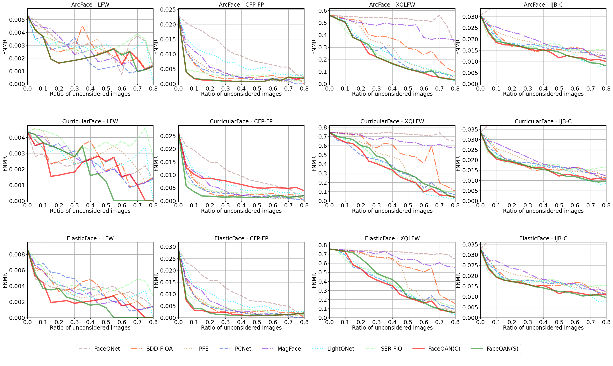

# **FaceQAN** _(Official repository)_

_This is the official repository of the [FaceQAN: Face Image Quality Assessment Through Adversarial Noise Exploration paper](link_to_paper, "FaceQAN paper") in proceedings of the ICPR 22 conference._

---

## **Table of Contents**

- [**FaceQAN** _(Official repository)_](#faceqan-official-repository)
  - [**Table of Contents**](#table-of-contents)
  - [**1. FaceQAN overview**](#1-faceqan-overview)
    - [**Abstract**](#abstract)
    - [**Motivation**](#motivation)
    - [**Methodology**](#methodology)
    - [**Results**](#results)
  - [**2. How-to**](#2-how-to)
    - [**Quality Score Inference**](#quality-score-inference)
    - [**XQLFW Evaluation**](#xqlfw-evaluation)
  - [**3. Citation**](#3-citation)

---

## **1. FaceQAN overview**

### **Abstract**

_Recent state-of-the-art face recognition (FR) approaches
have achieved impressive performance, yet unconstrained
face recognition still represents an open problem. Face
image quality assessment (FIQA) approaches aim to estimate the
quality of the input samples that can help provide information
on the confidence of the recognition decision and eventually
lead to improved results in challenging scenarios. While much
progress has been made in face image quality assessment in
recent years, computing reliable quality scores for diverse facial
images and FR models remains challenging. In this paper, we
propose a novel approach to face image quality assessment, called
FaceQAN, that is based on adversarial examples and relies on
the analysis of adversarial noise which can be calculated with
any FR model learned by using some form of gradient descent.
As such, the proposed approach is the first to link image quality
to adversarial attacks. Comprehensive (cross-model as well as
model-specific) experiments are conducted with four benchmark
datasets, i.e., LFW, CFP–FP, XQLFW and IJB–C, four FR
models, i.e., CosFace, ArcFace, CurricularFace and ElasticFace
and in comparison to seven state-of-the-art FIQA methods to
demonstrate the performance of FaceQAN. Experimental results
show that FaceQAN achieves competitive results, while exhibiting
several desirable characteristics._


### **Motivation**


**Visualization of adversarial noise as a function of image quality.** A clear difference can be observed in the characteristics of the adversarial noise between images of different quality. Higher quality images produce noise masks with a more distinct face-like pattern, while the lower quality masks are closer to random noise. FaceQAN takes advantage of the presented observations to estimate the quality of the input images.


### **Methodology**


**High-level overview of FaceQAN.** FaceQAN estimates the quality of an input sample *I* by exploring the characteristics of adversarial examples *I<sup>+</sup>* in the embedding space of the targeted FR model *M*. The final quality is estimated through an aggregation function $F$ that considers the similarity between the embedding of the input sample and $k$ adversarial examples, i.e., *i=1, . . . , k*. Moreover, the impact of pose on quality is modeled explicitly within FaceQAN through a face-symmetry estimation procedure based on image flipping.


### **Results**



**ERC results at FMR=0.001.** FaceQAN is evaluated using three state-of-the-art FR models over four datasets and in comparison to seven state-of-the-art baselines and yields highly competitive results. All results correspond to cross-model (C) quality assessment experiments. For reference purposes, model-specific FaceQAN results, marked (S), are also reported. 

---

## **2. How-to**

 > __DISCLAIMER!__
 > -
 >    FaceQAN is heavily reliant on __HOW THE IMAGES ARE CROPPED AND ALIGNED__. The images need to be cropped as specified by the FR model used for adversarial example generation.


### **Quality Score Inference**


This is a step-by-step guide showing you how to run FaceQAN quality score inference on one or more images.

   1. Clone the FaceQAN repository.
   
   2. Obtain the CosFace - pretrained model:

      - Download the CosFace-ResNet100 model pretrained on the Glint360k dataset, [available from the official InsightFace project GitHub repository.](https://1drv.ms/u/s!AswpsDO2toNKq0lWY69vN58GR6mw?e=p9Ov5d)
      - Rename the file to "weights.pth" and place it within the _./models_ folder.

      - Using a custom model:
         >  - To use a custom model you have to change the _\_\_calculate_score_batch()\_\__ function located within _calculate_qs.py_
         >  - Replace the line ```model : torch.nn.Module = load_cosface().eval().cuda()``` with your custom model loader
         >  - __DO NOT FORGET__ to also change the mean, deviation and transforms

         
   3. Setup enviroment:

         - We suggest using conda to setup the appropriate environment.

            - Create and activate a new conda environment

            - Install PyTorch using 
            ``` conda install pytorch torchvision torchaudio cudatoolkit=XX.X -c pytorch ```
            
            > Replace XX.X with the appropriate CUDA version for your graphics card.

   4. Run ```CUDA_VISIBLE_DEVICES=0 python calculate_qs.py -i "imagePath1" "imagePath2" ... "imagePathN" -sp "saveLocation" ```, where _imagePathX_ refers to the disk location of the X-th image to be processed, and _saveLocation_ refers to the disk location where the results will be stored.

      - The results are stored in a pickle format, which contains a dictionary of \<imagePathX\>:\<qualityScoreX\>(key:value) items.

      - Other hyper-parameters can be changed using the switches listed below:
        -  -e \<float\> : "changes the value of ε"
        -  -l \<int\> : "controls the number of iterations"
        -  -k \<int\> : "changes the batch size"
        -  -k \<int\> : "controls the exponent"

### **XQLFW Evaluation**

   1. _Perform steps 1., 2. and 3. from __[Quality Score Inference.](#quality-score-inference)___

   2. Download the __XQLFW__ original dataset, [available from the official XQLFW website.](https://martlgap.github.io/xqlfw/pages/download.html)

   3. Extract and copy the "lfw_original_imgs_min_qual0.85variant11" image folder into _./dataset_.

   4. Crop and align all images as specified by the FR model used for adversarial attacks. ```We suggest using either RetinaFace or MTCNN for face detection.```
   
   5. Run ```CUDA_VISIBLE_DEVICES=0 python evaluation/xqlfw_eval.py```

   6. The script will create a new pickle file with the quality scores of all XQLFW images in _./evaluation_

   > NOTE. Results may vary slightly between rounds due to the innate randomness of adversarial example generation.

---

## **3. Citation**

If you use any of the code provided in this repository, please cite the following paper:

``` 
 @inproceedings{babnikICPR2022,
  title={FaceQAN: Face Image Quality Assessment Through Adversarial Noise Exploration},
  author={Babnik, {\v{Z}}iga and Peer, Peter and {\v{S}}truc, Vitomir},
  booktitle={ICPR},
  year={2022},
}
``` 
